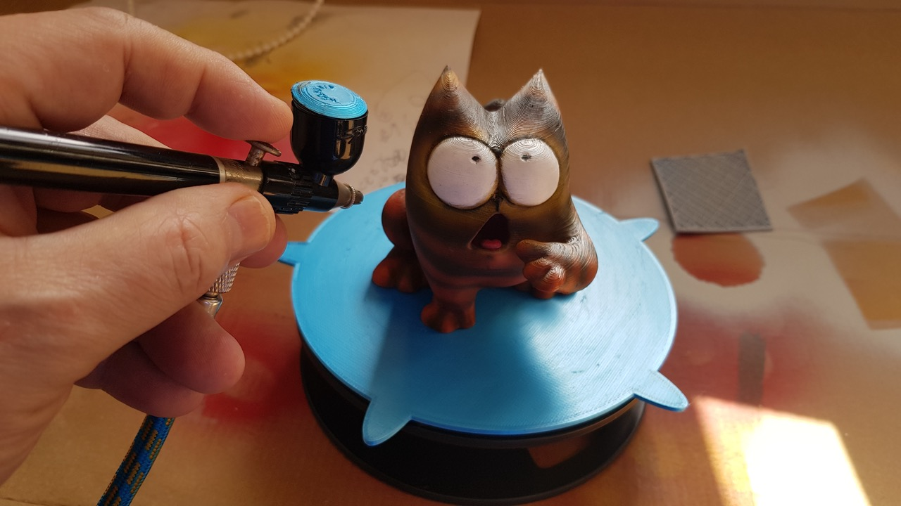
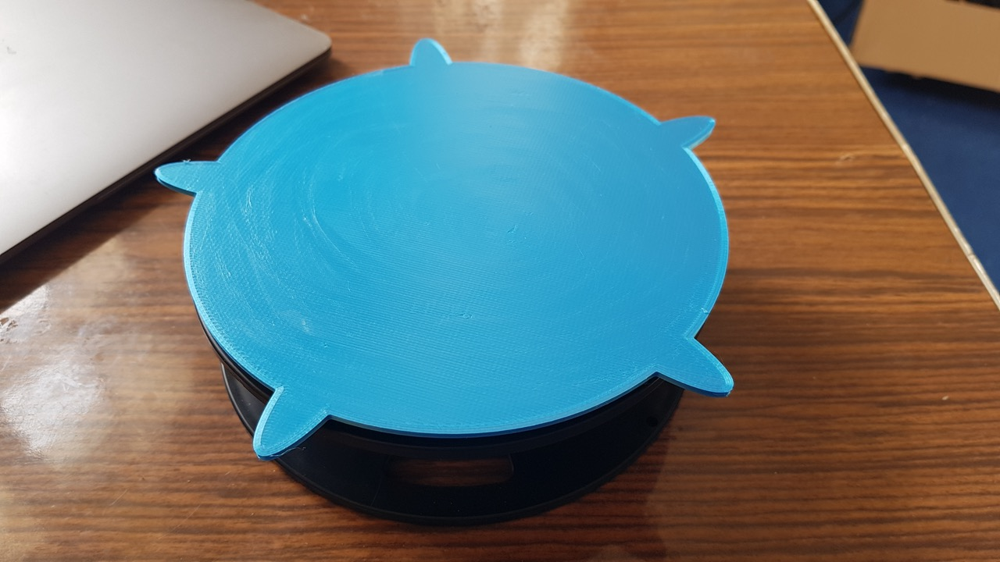
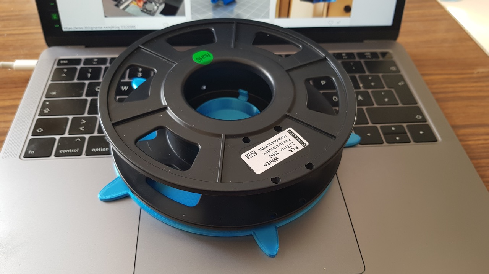
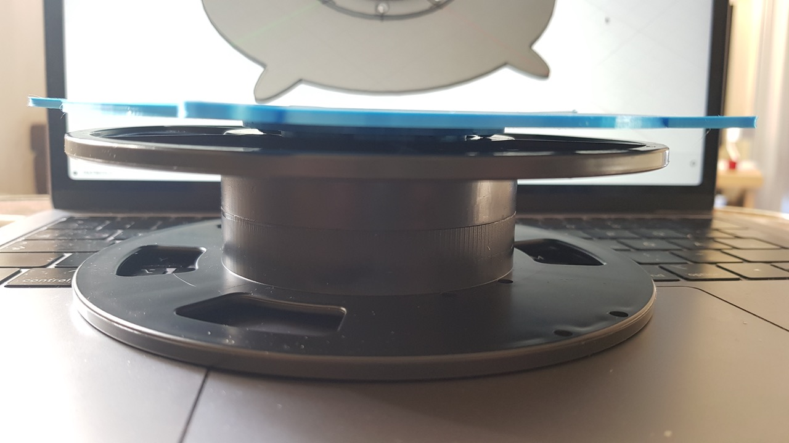
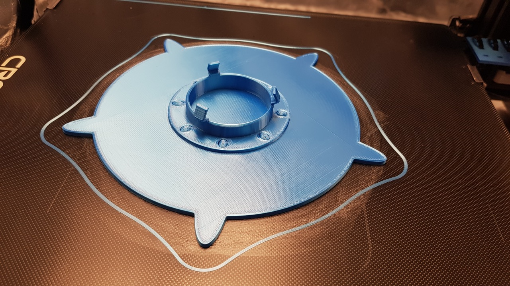
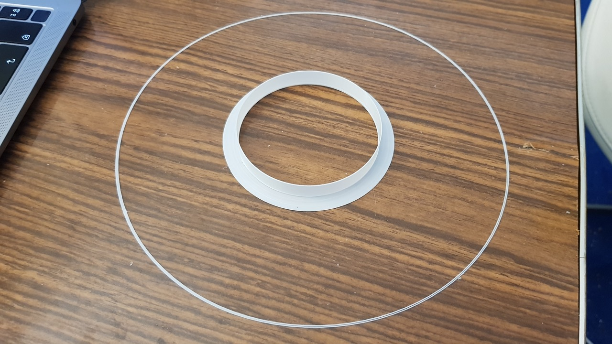
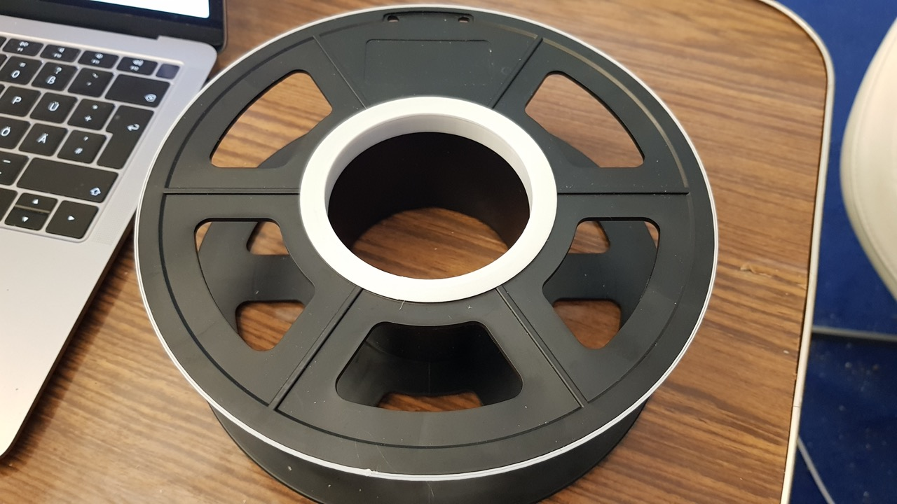
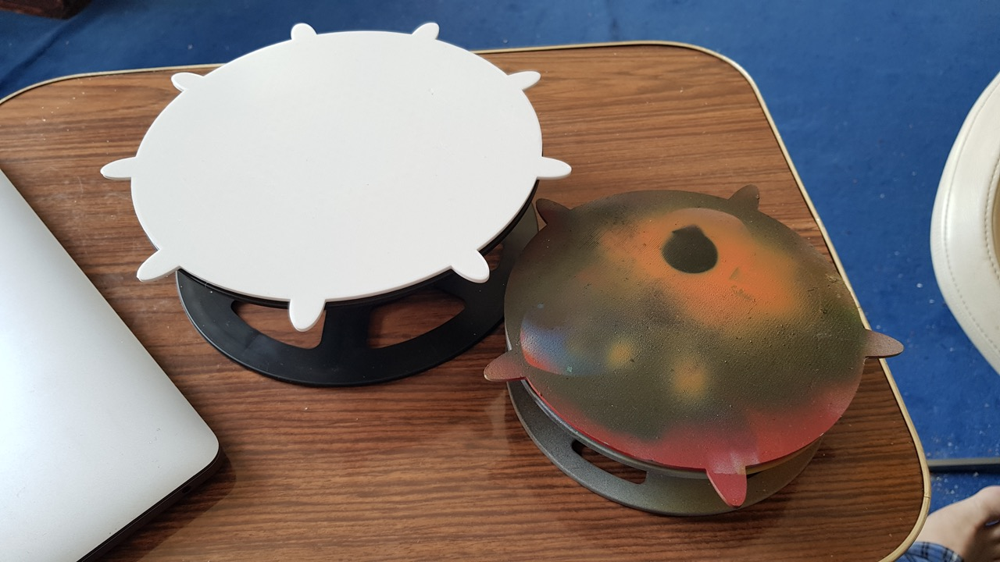

# scad-spool-painting-turntable
Spool Painting Turntable

**Update** (5 June 2021):

You can print test parts to verify your measurements of the diameters and inner ring height without wasting too much time and filament.

**Major update** (20 May 2021):

I have converted this model into a customizable version. From now on you can adjust the painting turntable to the individual size of your filament spool.

All you have to do is measure the diameter of the spool and the diameter of the spool hole. Just enter these values as basic parameters in the Customizer.

Please note that rendering in the Customizer takes some time. It is a bit faster if you use [OpenSCAD](https://openscad.org/) on your computer, but even there it takes some time.

If you don't use the Customizer, you can still download my original STL file for the small 200g spool.

**Original description:**

Included with my Creality CR10 printer was a **200g spool** of filament. The empty spool had been lying around unused for quite some time. So I decided to upcycle it and turned it into a painting turntable.

I use the turntable for my airbrush painting. If you want to attach the object you like to paint, just use double sided tape.

Since I don't know if the dimensions of the spool are common, here are my measurements: the inner diameter is about 52mm and the outer diameter is about 149mm. The height of the inner circle border is 5mm to hook up the table to the spool.

## Test Parts

You can print test parts to verify your measurements without wasting too much time and filament.

You may use the vase mode (aka "spiralize outer contour"), two walls and concentric bottom shell filling.

## Use OpenSCAD

1. **Download and install:** [OpenSCAD](http://openscad.org/) version 2021.01 or newer
2. **Download:** The *.scad file of this model.
3. **Start** OpenSCAD and **open** the *.scad file in it.
4. **Open the customizer** via the menu "Window/Customizer"

Now you can configure the model and use the `F5` key to render the preview of your changes.

### Export your STL file

If you're done with your model settings, you can export the STL file:

1. Render the mesh by pressing the `F6` key.
2. Wait until the rendering is finished. This might take some minutes.
3. Export the STL file by pressing the `F7` key.

### Optionally save your configuration

If you like to use your configuration as a template for further models, it's a good idea, to save your configuration:

1. Click the `+` symbol in the customizer, which you find beside the configuration selector drop-down in the second line of the customizer.
2. Give your configuration a name.

Use the drop-down menu to access your saved configurations.
